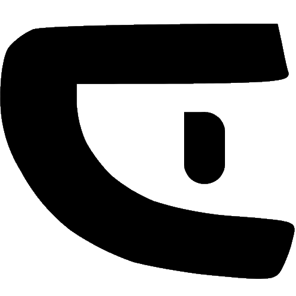

<p align="center">
  
</p>

<h1 align="center">Cipheria</h1>

<p align="center">
  A secure, local-only TOTP authenticator with QR code import, encryption, and a beautiful UI
</p>

<p align="center">
  <a href="#features">Features</a> •
  <a href="#demo">Demo</a> •
  <a href="#installation">Installation</a> •
  <a href="#usage">Usage</a> •
  <a href="#security">Security</a> •
  <a href="#tech-stack">Tech Stack</a>
</p>

<p align="center">
  
  
  
</p>

---

Cipheria is a modern, privacy-focused TOTP (Time-Based One-Time Password) authenticator that runs entirely in your browser. Unlike cloud-based solutions, Cipheria never sends your secrets to any server - everything is stored locally and encrypted with military-grade AES-GCM encryption.

## 🌟 Features

- **🔒 100% Local**: All secrets stay on your device, never leave your browser
- **🔐 Military-Grade Encryption**: PBKDF2 → AES-GCM encryption for all stored data
- **📷 QR Code Import**: Easily import accounts by uploading QR code images
- **🎨 Beautiful UI**: Polished interface with light/dark mode support
- **⚡ Fast & Responsive**: Built with Next.js for optimal performance
- **📱 Mobile Friendly**: Works great on all device sizes
- **🧩 Easy Migration**: Easily switch from any authenticator like Google, Proton, Bitwarden, etc.
- **🔄 Sync Ready**: Export your encrypted database for safekeeping

## 🎬 Demo

https://github.com/user-attachments/assets/placeholder-video-showing-cipheria-in-action.mp4

*Note: This is a placeholder. Actual demo video coming soon.*

## 🚀 Installation

### Prerequisites

- Node.js 18+ installed
- npm, yarn, or pnpm package manager

### Quick Start

```bash
# Clone the repository
git clone https://github.com/DevJSTAR/Cipheria.git

# Navigate to the project directory
cd cipheria

# Install dependencies
npm install

# Run the development server
npm run dev
```

Open [http://localhost:3000](http://localhost:3000) in your browser to see the application.

### Production Build

```bash
# Build for production
npm run build

# Start the production server
npm start
```

## 💡 Usage

1. **First Run**: Set up your master password to encrypt your TOTP accounts
2. **Add Accounts**:
   - Click "Add Manually" to enter account details
   - Use "Import from QR" to upload QR code images
   - Import from file (Proton Authenticator format supported)
3. **Access Codes**: Your TOTP codes update automatically every 30 seconds
4. **Manage Accounts**: Edit or delete accounts as needed
5. **Backup**: Export your encrypted database regularly

## 🔐 Security

Cipheria prioritizes your security and privacy:

- **Zero Knowledge**: Your secrets never leave your device
- **End-to-End Encryption**: All data encrypted with PBKDF2 → AES-GCM
- **No Analytics**: No tracking or data collection of any kind
- **QR Code Safety**: Images deleted immediately after decoding
- **Open Source**: Fully auditable codebase

### Encryption Details

1. **Key Derivation**: PBKDF2 with 100,000 iterations
2. **Encryption**: AES-256-GCM
3. **Storage**: Encrypted data stored in browser's IndexedDB
4. **Password**: Never stored, only used for encryption/decryption

### Testing Encryption Strength

To verify that your data is properly encrypted:

1. **Browser DevTools Check**:
   - Open Developer Tools (F12)
   - Go to Application/Storage tab
   - Look for IndexedDB storage
   - Data should appear as encrypted strings, not readable account information

2. **File Export Verification**:
   - Export your database
   - Open the file in a text editor
   - Verify that account information is not human-readable

3. **Network Tab Monitoring**:
   - Open Developer Tools Network tab
   - Use the application normally
   - Verify no account data is sent to external servers

## 🛠 Tech Stack

- **[Next.js 15](https://nextjs.org/)** - React framework with App Router
- **[TypeScript](https://www.typescriptlang.org/)** - Type-safe JavaScript
- **[Tailwind CSS](https://tailwindcss.com/)** - Utility-first CSS framework
- **[shadcn/ui](https://ui.shadcn.com/)** - Re-usable components built with Radix UI
- **[Framer Motion](https://www.framer.com/motion/)** - Animation library
- **[Lucide React](https://lucide.dev/)** - Beautiful SVG icons
- **[Zod](https://zod.dev/)** - TypeScript-first schema validation
- **[React Hook Form](https://react-hook-form.com/)** - Performant, flexible forms

## 🤝 Contributing

Contributions are welcome! Please read our [Contributing Guide](CONTRIBUTING.md) first.

1. Fork the repository
2. Create your feature branch (`git checkout -b feature/AmazingFeature`)
3. Commit your changes (`git commit -m 'Add some AmazingFeature'`)
4. Push to the branch (`git push origin feature/AmazingFeature`)
5. Open a Pull Request

## 📄 License

This project is licensed under the Apache 2.0 License - see the [LICENSE](LICENSE) file for details.

## 👨‍💻 Author

**Junaid** - [junaid.xyz](https://junaid.xyz)

<p align="center">
  Made with ❤️ by <a href="https://junaid.xyz" target="_blank">Junaid</a>
</p>
